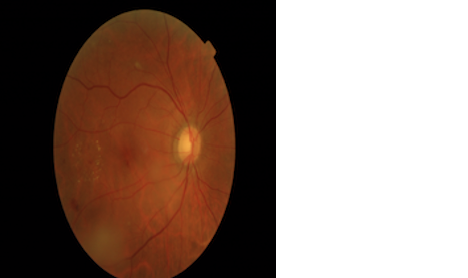
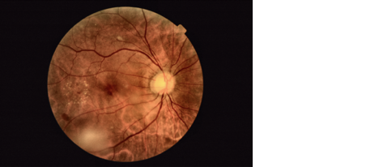
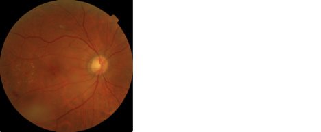
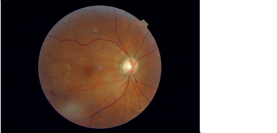
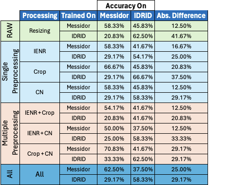
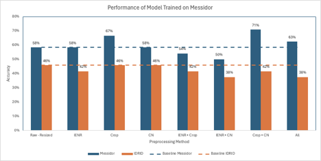
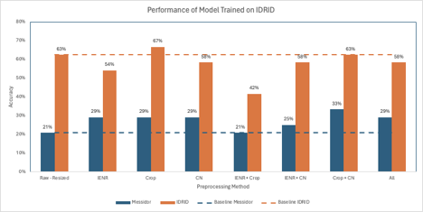

# ML Final Project - The Impact of Image Preprocessing on Diabetic Retinopathy Detection

[](https://github.com/nogibjj/Diabetic-Retinopathy/actions/workflows/cicd.yml)

## Contents
1. [Overview](#1-overview)
2. [Experiments](#2-experiments)
3. [Results](#3-results)
4. [Project Execution Instructions](#4-instructions-for-running-the-project)
5. [Repository Information](#5-repository-information)
6. [Team Members](#6-team-members)


## 1. Overview
Diabetic Retinopathy (DR) is the leading cause of blindness among individuals aged 20 to 74 years and is one of the foremost complications of diabetes, as well as a major cause of preventable blindness. Diabetes, affecting 422 million people worldwide, is on the rise, particularly in middle- and low-income countries. It is crucial, therefore, that the health systems in these countries are equipped with the necessary tools and technologies to manage this chronic disease's outcomes. Machine learning models introduce new approaches to medical diagnosis and have the potential to relieve overburdened health services by preventing the diseases that strain them the most. For us data scientists, it is gratifying to apply our expertise to address issues that not only present global challenges but also impact our own nations.  
Machine learning techniques have offered alternative methods for diagnosing Diabetic Retinopathy by analyzing retinal images. The cameras used to capture these images vary in specifications, including color profiles and field of view (FOV). We hypothesized that a model trained on images from one camera type may underperform when presented with images from another camera. The core issue we addressed is whether the generalizability of detection models can be enhanced through preprocessing techniques like luminosity adjustment, cropping, and color normalization. The results from our study suggest that using certain preprocessing techniques on retinal images could improve both the generalizability of the models and their effectiveness in the accurate diagnosis of diabetic retinopathy, regardless of the camera type.  

For Additional Information on the Background, Data, Experimental setup etc. please refer to our [Final Report](./03_Resources/Final_Report.pdf).

## 2. Experiments
All the Images were Resized to standard sizes of (512x512) or (224x224) so that they can be used with the models, this was a required step for all the models and hence we did not consider it as such as a pre-processing step but as the baseline for all the models.  
  

As a part of our project, we studied the following pre-processing techniques, both individually and in combination, to determine their impact on the performance of the model:

1. Image Enhancement and Noise Reduction (IENR):  
  

2. Cropping:  
  

3. Color Normalization (CN):  
  

## 3. Results
The results of our experiments are summarized in the table below. and they have been visualized in the following graphs for easier understanding.
please refer to our [Final Report](./03_Resources/Final_Report.pdf) for more details on the results and the experiments.

Overall Results:  
  

Results for the Models Trained on Messidor Data:  
  

Results for the Models Trained on Idrid Data:  
   

## 4. Instructions for Running the Project

### 4.1 Downloading Data from AWS S3
Since the primary data used in our project was images and the total size of the data is comparatively large, to enable better collaboration and avoid the need for each person to repeatedly perform the pre-processing steps for our analysis, the images have been pre-processed and saved as numpy vectors in zip files. These zip files are stored in an AWS S3 bucket. 

Each of the zip files contains the following:
- X_train.npy
- X_test.npy
- y_train.npy
- y_test.npy

The user only needs to provide the path to the folder containing these files, the code will automatically load the data and perform the necessary steps by itself.

#### Option 1: Downloading Data from AWS using the ``s3_download.py`` script
This will download the Selected folder from the AWS S3 bucket.

run the s3_download.py script using the following command:
```bash
python3  ./01_Codes/custom_functions/s3_download.py <Data Name>
```

The {Data Name} can be constructed using the following levels, as required, separated by a '/':

A. The Base Folders are:
- Messidor
- Idrid
- Ddr

B. The Subfolders Within Messidor and Idrid are:
- {Messidor/Idrid}_Raw.zip : The Raw Images, Big in Size **DON'T** download unless needed
- Resized_512 : Images Resized to 512x512 for use with CNN512
- Resized_224 : Images Resized to 224x224 for use with EfficientNetB0

C. Within the Resized_XXX folders, there will be 4 files, all of them will be of size (XXX, XXX):
- {Messidor/Idrid}_XXX_CN.zip : Color Normalized
- {Messidor/Idrid}_XXX_IENR.zip : Image Enhancement and Noise Reduction
- {Messidor/Idrid}_XXX_Crop.zip : Cropped Images
- {Messidor/Idrid}_XXX_Raw.zip : Only Resized Images

It is suggested to download at the level of the Resized_XXX folders, so that we don't download the large raw images and we get the 4 files required to run our part of the project.

**Recomended Usage**: Run this in the terminal from the project root directory.

```bash
python3  ./01_Codes/custom_functions/s3_download.py {Data}/Resized_{Size}/
```

- Data: Messidor or Idrid
- Size: 512 or 224

This will download the 4 files to the aws_s3 folder in the project root directory.


#### Option 2: Downloading Data from AWS using the ``s3_pull.sh`` script
This will download all the files from the AWS S3 bucket folder. this is **NOT** recommended as it will download all the files from the AWS S3 bucket.

run the s3_pull.sh script from the home directory using the following command:
```bash
bash s3_pull.sh
```

**Notes**: 
- It is recomended to download the data using the s3_downlaod script so that only the required data is downloaded, else it will take a long time to download all the data if you are not planning to use all of it.
- Due to cost implications, we may shut down the AWS S3 bucket after the project is completed, in that case the pre-processed data will not be available for download via AWS S3, you can still download the raw images from the respective sources and pre-process them using the code provided in the project. please reach out to the [team members](#5-team-members) for more information if required.

### 4.2 Downloaded Data Extraction

use the s3_extract funtion to extract the downloaded data, this will extract from the zip file and save the data in regular folders.

- In case no file is specified, it will extract all the zip files in the aws_s3 folder.
- In case no arguement is passed for the temp variable, by default it will extract the files within the aws_s3 folder.

It is recommended to keep the temp variable as True, so that the files are extracted within the aws_s3 folder which is not tracked by git.      
if temp is set to False, the files will be extracted to the project root directory and will be tracked by git which is not recommended.

**Recomended Usage**:

```bash
python3  ./01_Codes/custom_functions/s3_extract.py All
```

### 4.3 Running the Experiments
The experiments can be replicated and run using the [00_EfficientNetB0](./01_Codes/00_EfficientNetB0.ipynb) file. follow the instructions in the file to run the experiments. 

please note that the file works on the processed Numpy vectors and not raw images, so make sure to download the processed data using the above steps before running the experiments.


## 5. Repository Information
The folder structure of the repository is as follows:

### 01_Codes
Contains all the codes used in the project.  
Each member has their own folder to work on their part of the project. and there are a few additional folders such as custom_functions which contains the functions used across the project and extra which contains some testing or temporary codes which are not part of the final project.

The folder also contains the [00_EfficientNetB0](./01_Codes/00_EfficientNetB0.ipynb) file in the root so that users can easily access the main file for running the experiments.

### 02_Data
Contains some useful and frequently used data such as the labels for the images and few selected sample images for testing the code if required.

**Note**: This folder does not contain main data used in the project, that is stored in the AWS S3 bucket and can be downloaded using the instructions provided above.

### 03_Resources
Contains the images used for the README file and the [Final Report](./03_Resources/Final_Report.pdf) for the project.

if you will be forking or cloning the repository, please be aware of the following:
- The .devcontainer folder has 2 images, 1 for the CPU and 1 for the GPU, please use the appropriate one when starting the container or codespaces
- The repository automatically runs the CI/CD pipeline whenever there is a change to the python (.py or .ipynb) files, it performs Linting and Formatting but Does NOT test the code, please make sure to test the code before pushing it to the repository. disable the CI/CD pipeline if you do not have subscription to github actions.

## 6. Team Members
please feel free to reach out to any of the team members for any queries or clarifications:
- [Afraa](https://github.com/afraa-n)
- [Daniela](https://github.com/dani-jimlar)
- [Revanth](https://github.com/revanth7667)
- [Tina](https://github.com/tinayiluo0322)